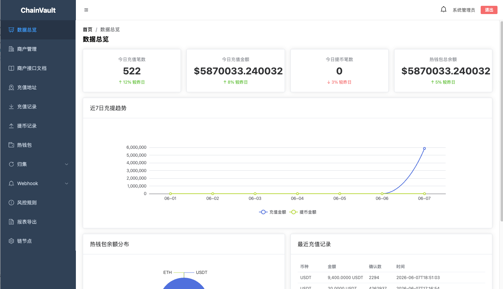
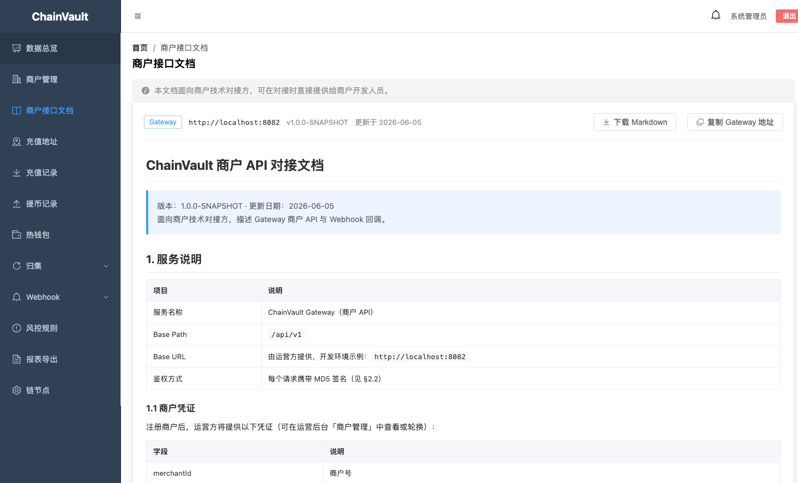
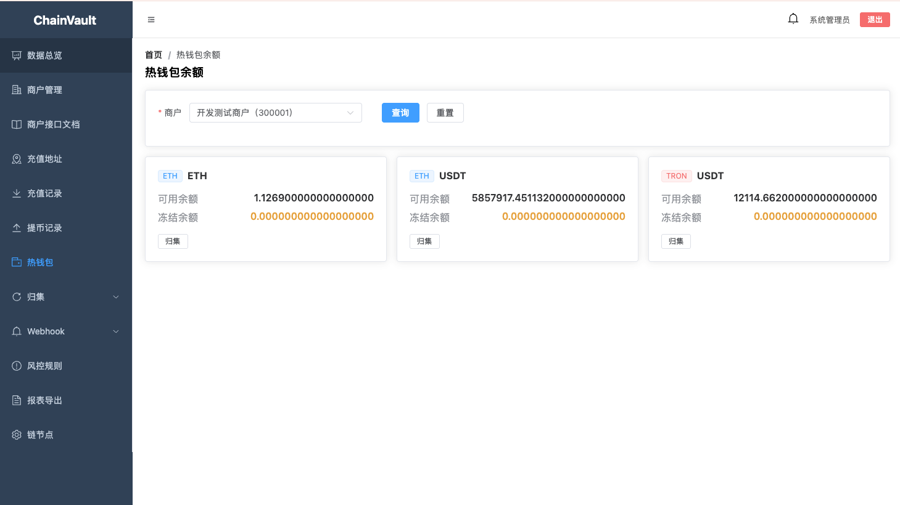
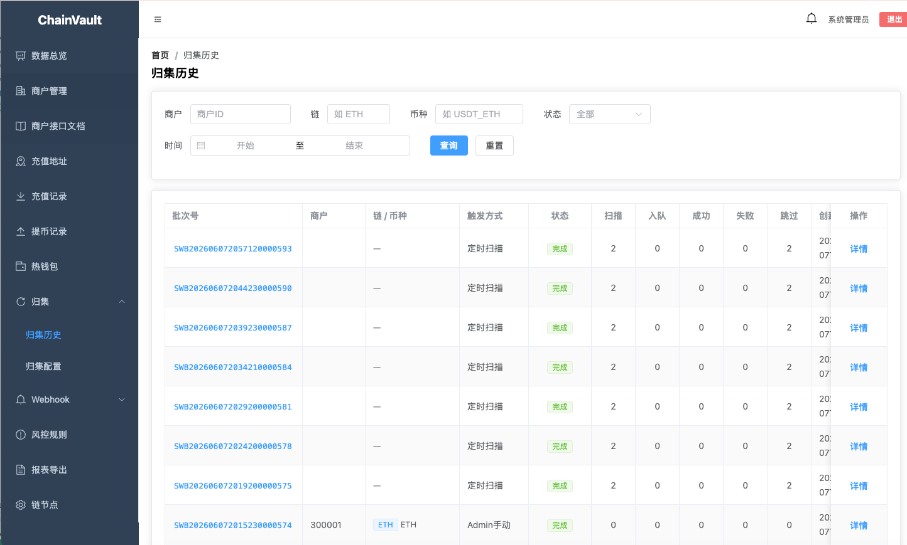
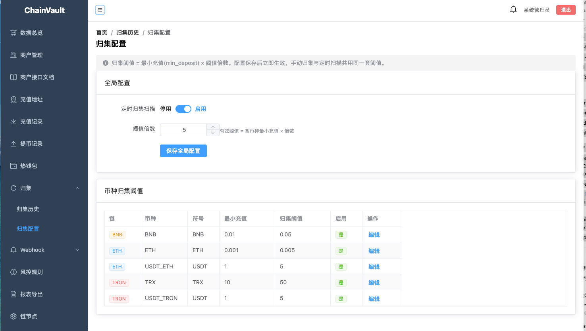
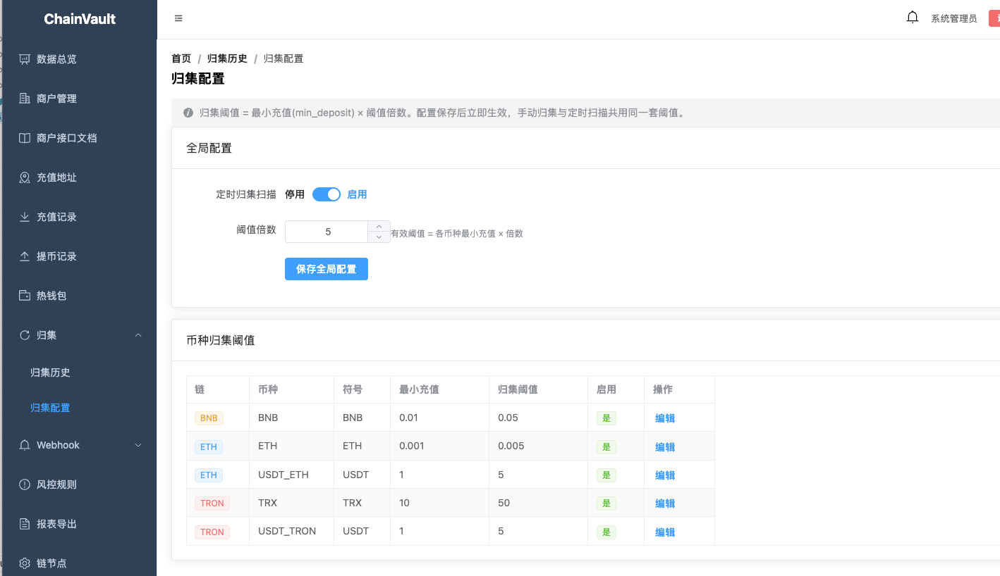

# ChainVault

[中文](README.md) | **English**

Open-source multi-chain crypto deposit & withdrawal gateway — a self-hosted merchant solution comparable to [UDUN](https://www.udun.io/). Supports deposit address allocation, on-chain monitoring, withdrawals, Webhook callbacks, hot-wallet sweeps, and an admin console.

<p align="center">
  
  <br/>
  <sub>Vue 3 Admin Console · Dashboard</sub>
</p>

## Features

| Module | Capabilities |
|--------|--------------|
| **Merchant API (Gateway)** | MD5 signature auth, rate limiting, deposit address generation, single/batch withdrawals, balance & transaction queries, Webhook management |
| **On-chain monitoring** | Parallel block scanning for ETH / BNB (EVM), TRON, BTC; confirmation tracking; deposit crediting |
| **Webhook** | `deposit.pending` / `deposit.confirmed` events, HMAC-SHA256 signatures, retry on failure |
| **Fund sweep** | Threshold scanning, batch records, manual/scheduled triggers, configurable threshold multiplier in admin |
| **Admin console** | JWT login, merchant management, deposit/withdrawal records, hot wallet, chain node config, sweep history & settings |
| **Key management** | BIP44 HD derivation, AES-encrypted mnemonics, multi-chain address generation, offline signature verification |

**Supported chains (open source):** ETH, BNB Chain, TRON, BTC (plus on-chain USDT and other tokens)

## Screenshots

### Merchant API documentation

Built-in Gateway integration guide: base path, MD5 signing rules, headers, and examples. Copy Gateway URL or download Markdown in one click.



### Hot wallet balances

View available/frozen balances by merchant, chain, and coin. Trigger per-coin sweeps from the admin UI.



### Sweep history

Batch ID, trigger type (scheduled scan / manual admin), success/failure/skip counts, and drill-down details for full auditability.



### Sweep configuration

Global scheduled scan toggle, threshold multiplier (sweep threshold = min deposit × multiplier), and per-asset thresholds for ETH / BNB / TRON.



<p align="center">
  
  <br/>
  <sub>Per-asset sweep thresholds · ETH / BNB / TRON</sub>
</p>

## Tech stack

| Layer | Technology |
|-------|------------|
| Backend | Java 21, Spring Boot 3.3, MyBatis-Plus, Maven multi-module |
| Frontend | Vue 3, TypeScript, Vite, Element Plus, Pinia |
| Storage | MySQL 8, Redis 7 |
| Chain SDK | web3j, bitcoinj, TronGrid HTTP API |

## Project structure

```
chainvault/
├── README.md
├── README.en.md
├── backend/
│   ├── code/                    # Maven multi-module source
│   │   ├── chainvault-common/   # Shared utils, enums, exceptions
│   │   ├── chainvault-keyvault/ # BIP44 derivation, signing
│   │   ├── chainvault-chainnode/# Block scanning, RPC clients
│   │   ├── chainvault-core/     # Core business (merchants, txs, sweep, Webhook)
│   │   ├── chainvault-gateway/  # Public merchant API (default 8080)
│   │   ├── chainvault-admin/    # Admin API (8081)
│   │   └── sql/                 # Database migrations
│   ├── docker/                  # MySQL Docker Compose
│   └── docs/                    # API documentation
└── frontend/                    # Vue admin UI
```

## Requirements

- **Java 21** ([SDKMAN](https://sdkman.io/) recommended; see `backend/code/.sdkmanrc`)
- **Maven 3.9+**
- **Node.js 18+** and npm (frontend)
- **Redis 7** (local `127.0.0.1:6379`)
- **Docker** (MySQL 8, host port `3307`)

## Quick start

### 1. Start infrastructure

```bash
# Redis (macOS example)
brew services start redis
redis-cli ping   # should return PONG

# MySQL 8
cd backend/docker
docker compose up -d
```

### 2. Initialize database

Run SQL scripts in order (from `backend/code`):

```bash
cd backend/code

docker exec -i chainvault-mysql mysql -u chainvault -pchainvault_dev chainvault < sql/init.sql
docker exec -i chainvault-mysql mysql -u chainvault -pchainvault_dev chainvault < sql/V2_keyvault.sql
docker exec -i chainvault-mysql mysql -u chainvault -pchainvault_dev chainvault < sql/V3_deposit.sql
docker exec -i chainvault-mysql mysql -u chainvault -pchainvault_dev chainvault < sql/V4_admin_user.sql
docker exec -i chainvault-mysql mysql -u chainvault -pchainvault_dev chainvault < sql/V5_chain_node_config.sql
docker exec -i chainvault-mysql mysql -u chainvault -pchainvault_dev chainvault < sql/V6_chain_node_api_key.sql
docker exec -i chainvault-mysql mysql -u chainvault -pchainvault_dev chainvault < sql/V8_sweep_history.sql
docker exec -i chainvault-mysql mysql -u chainvault -pchainvault_dev chainvault < sql/V9_sweep_config.sql
```

> Skip `V7_deposit_replay_test.sql` and `V8_migrate_redis_swept_data.sql` on fresh installs (test/migration only).

### 3. Build backend

```bash
cd backend/code
sdk env   # if SDKMAN is installed
export JAVA_HOME="$HOME/.sdkman/candidates/java/21.0.5-tem"
export PATH="$JAVA_HOME/bin:$PATH"

mvn install -DskipTests
```

### 4. Start Gateway (merchant API + block scanner)

Gateway handles block scanning, confirmation tracking, Webhook delivery, and scheduled sweeps. **It must be running** for deposits to be recorded.

```bash
cd backend/code/chainvault-gateway
mvn spring-boot:run
# Default port 8080; use 8082 if occupied:
# mvn spring-boot:run -Dspring-boot.run.arguments=--server.port=8082
```

Health check:

```bash
curl http://localhost:8080/actuator/health
```

### 5. Start Admin (admin API)

```bash
cd backend/code/chainvault-admin
mvn spring-boot:run -Dspring-boot.run.arguments=--server.port=8081
```

> After changing `chainvault-core`, run `mvn install -pl chainvault-core,chainvault-admin -am -DskipTests` before restart, or you may hit `ClassNotFoundException`.

### 6. Start frontend

```bash
cd frontend
npm install
npm run dev
```

Open the Vite dev URL (usually `http://localhost:5173`). The frontend proxies to Admin (8081) and Gateway (8082); adjust in `frontend/vite.config.ts`.

## Default credentials & test data

Available after running `V4_admin_user.sql`:

| Purpose | Field | Value |
|---------|-------|-------|
| Admin login | username / password | `admin` / `admin123` |
| Test merchant | merchantId | `300001` |
| Test merchant | apiKey | `cv_dev_api_key_001` |
| Test merchant | secretKey | `cv_dev_secret_key_001` |

**Change default passwords and keys before production.**

## Chain node configuration

RPC endpoints can be managed in the admin UI (`chain_node_config` / `chain_node_api_key` tables). DB config overrides environment variables.

| Variable | Description |
|----------|-------------|
| `ETH_RPC_URL` | Ethereum RPC (e.g. Infura / Alchemy) |
| `BNB_RPC_URL` | BNB Chain RPC |
| `TRON_API_KEY` | TronGrid API key (optional) |
| `BTC_RPC_URL` / `BTC_RPC_USER` / `BTC_RPC_PASSWORD` | Bitcoin Core RPC |

If overseas RPC endpoints are unreachable, enable HTTP proxy:

```bash
export RPC_PROXY_ENABLED=true
export RPC_PROXY_HOST=127.0.0.1
export RPC_PROXY_PORT=7897
```

## Merchant API signing

Gateway requests use **MD5** signatures (UDUN-compatible):

```
sign = MD5(body + "&" + timestamp + "&" + nonce + "&" + secretKey).toLowerCase()
```

Headers: `X-Api-Key`, `X-Timestamp` (seconds), `X-Nonce`, `X-Sign`

Webhook callbacks use **HMAC-SHA256**. See [backend/docs/API.md](backend/docs/API.md).

## Deposit flow

```
Merchant order → POST /api/v1/address/create → deposit_address created
                        ↓
User sends on-chain → Gateway scans blocks, matches address → transaction_record (pending)
                        ↓
Confirmations met → success → Webhook deposit.confirmed
                        ↓
(optional) Sweep threshold met → hot wallet sweep → recorded in sweep history
```

Creating a payment address **does not** create a deposit record. Credits appear only after an on-chain transfer is detected and matched. Configure sweep thresholds and schedules in admin (see screenshots above).

## Service ports

| Service | Default port | Notes |
|---------|--------------|-------|
| Gateway | 8080 | Merchant API; use 8082 in dev if occupied |
| Admin | 8081 | Admin API |
| Frontend | 5173 | Vite dev server |
| MySQL | 3307 | Docker host mapping (3306 in container) |
| Redis | 6379 | Local |

## Common environment variables

| Variable | Default | Description |
|----------|---------|-------------|
| `DB_USER` / `DB_PASS` | `chainvault` / `chainvault_dev` | MySQL credentials |
| `REDIS_HOST` / `REDIS_PORT` | `127.0.0.1` / `6379` | Redis |
| `MASTER_ENCRYPT_KEY` | 32-byte dev key | Mnemonic encryption; **inject from KMS/Vault in production** |
| `ADMIN_JWT_SECRET` | Built-in dev secret | Admin JWT signing key |

## Documentation

- [Backend API reference](backend/docs/API.md)
- [Development plan](backend/DEVELOPMENT_PLAN.md)
- [Merchant API guide](backend/docs/MERCHANT_API.md)

## Production deployment

1. Set `chainvault.broadcast-simulate` to `false`; configure real chain RPC and hot wallets
2. Use dedicated `MASTER_ENCRYPT_KEY` and `ADMIN_JWT_SECRET` — never repo defaults
3. Package Gateway and Admin separately: `mvn package -DskipTests`, then run each module’s `target/*.jar`
4. Build frontend: `cd frontend && npm run build`, serve `dist/` via Nginx or similar
5. Prefer managed or HA MySQL and Redis

## License

This repository is the ChainVault open-source edition. Commercial extensions (more chains, risk engine, KYC, multi-sig approval, etc.) are not included here.

## Contact

- Telegram: [@maotouying_cc](https://t.me/maotouying_cc)

## Repository

https://github.com/colebishsj937/chainvault
