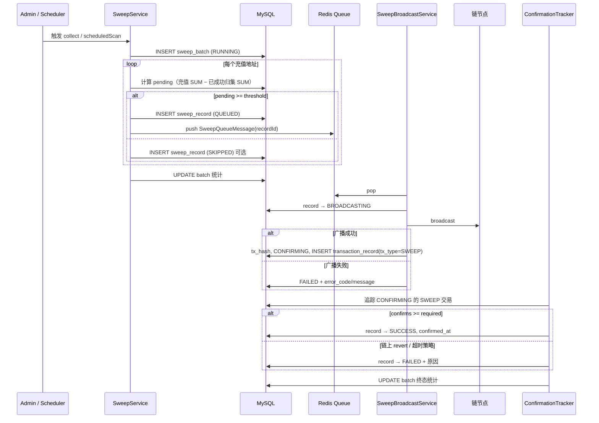
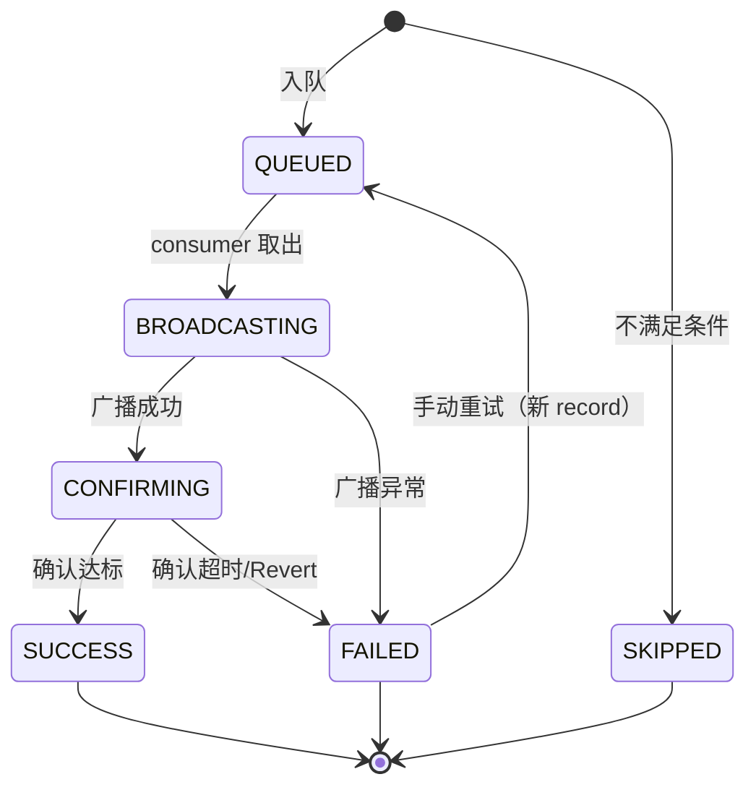

# 归集历史 PRD & 表结构草案

> 版本：v0.1 · 2026-06-07  
> 状态：草案（待评审）  
> 范围：Admin 归集历史（批次 + 地址明细）、链上确认、手动重试、DB 为已归集金额唯一真相

---

## 1. 背景与目标

### 1.1 现状

| 能力 | 现状 |
|------|------|
| 触发 | Admin `POST /wallets/{chainCode}/collect`、Gateway 定时 `SweepScheduler`、Gateway 商户 API `POST /api/v1/sweep/trigger` |
| 队列 | Redis `cv:queue:sweep` |
| 已归集进度 | Redis `cv:sweep:swept:{chainCode}:{address}`，TTL 30 天 |
| 持久化 | 无 DB 表；失败原因仅日志 |
| 确认 | 广播后即写 Redis，**不等链上确认** |

### 1.2 目标

1. **两层历史**：批次（`sweep_batch`）+ 地址明细（`sweep_record`）。
2. **状态含链上确认**：广播后进入确认中，达标后才计为成功并计入已归集金额。
3. **仅 Admin 可见**：不提供 Gateway 商户归集历史 API（触发 API 可保留）。
4. **失败手动重试**：有历史后支持单条或整批重试；历史展示错误码与可读原因。
5. **DB 为唯一真相**：已归集金额从 `sweep_record` 聚合，废弃 Redis swept 键的读写（队列 Redis 保留）。

### 1.3 非目标（本期不做）

- 失败自动重试 / 指数退避调度
- 商户侧归集历史查询
- CSV 导出、统计报表
- 与 `hot_wallet.balance` 自动联动（归集成功不直接改热钱包表，仍由充值入账逻辑负责）

---

## 2. 术语

| 术语 | 说明 |
|------|------|
| 批次 | 一次扫描触发产生的归集任务集合（手动或定时） |
| 明细 | 单个充值地址上的一笔归集尝试 |
| 待归集余额 | `已确认充值总额 − 已成功归集总额` |
| 已归集金额（SSOT） | `SUM(sweep_record.amount) WHERE status = SUCCESS` |

---

## 3. 用户故事

### 3.1 运营（Admin）

1. 在热钱包页触发归集后，可打开「归集批次列表」查看本次扫描入队多少、成功/失败各多少。
2. 点进批次，查看每条地址的归集金额、状态、txHash、确认进度、失败原因。
3. 对 **FAILED** 明细点击「重试」，或勾选多条 / 整批失败项批量重试。
4. 在充值地址维度查询「该地址归集历史」与当前待归集余额（DB 计算）。

### 3.2 开发/运维

1. 排查 TRON 归集失败时，可直接看到 `error_code` + `error_message`（如 RPC 超时、余额不足、nonce 错误）。
2. 不再依赖 Redis swept 键排查进度；DB 可审计、可备份。

---

## 4. 业务流程

### 4.1 主流程（扫描 → 确认）



### 4.2 待归集余额计算（DB SSOT）

```
totalDeposits = SUM(transaction_record.amount)
  WHERE tx_type = DEPOSIT
    AND status IN (SUCCESS, NOTIFIED)
    AND merchant_id / coin_type / to_address 匹配

alreadySwept = SUM(sweep_record.amount)
  WHERE status = SUCCESS
    AND merchant_id / coin_type / from_address 匹配

pending = totalDeposits − alreadySwept
```

> **迁移**：上线前一次性脚本，将 Redis `cv:sweep:swept:*` 回灌为 `SUCCESS` 状态的 `sweep_record`（`batch_no = MIGRATION-*`），或标记 `source=MIGRATION`；之后代码不再读写 Redis swept。

### 4.3 手动重试

| 规则 | 说明 |
|------|------|
| 可重试状态 | 仅 `FAILED` |
| 不可重试 | `SUCCESS`、`CONFIRMING`、`BROADCASTING`、`QUEUED` |
| 单条重试 | 基于原明细复制新 `sweep_record`，`parent_record_id` 指向原记录，`retry_seq = 原.retry_seq + 1` |
| 批次重试 | 对批次内所有 `FAILED` 明细批量创建重试记录并入队 |
| 自动重试 | **无**；`retry_count` 仅统计人工触发次数 |

重试时 **重新计算** `pending`（避免已成功部分重复归集）。

---

## 5. 状态机

### 5.1 批次 `SweepBatchStatus`

| 码 | 枚举 | 含义 | 进入条件 |
|----|------|------|----------|
| 0 | CREATED | 已创建 | INSERT 批次 |
| 1 | RUNNING | 执行中 | 开始扫描/已有明细入队 |
| 2 | COMPLETED | 全部终态 | 所有明细 ∈ {SUCCESS, FAILED, SKIPPED} 且至少一条 SUCCESS |
| 3 | PARTIAL_FAILED | 部分失败 | 同上，但存在 FAILED |
| 4 | FAILED | 全部失败 | 所有非 SKIPPED 均为 FAILED |
| 5 | CANCELLED | 已取消 | 预留，本期不实现取消 API |

批次终态由明细聚合任务（广播 consumer 或定时 reconciler）更新。

### 5.2 明细 `SweepRecordStatus`

| 码 | 枚举 | 含义 |
|----|------|------|
| 0 | PENDING | 已扫描待决策（可选，可直接 QUEUED/SKIPPED） |
| 1 | QUEUED | 已入 Redis 队列 |
| 2 | BROADCASTING | 广播进行中 |
| 3 | CONFIRMING | 已广播，等待链上确认 |
| 4 | SUCCESS | 确认数达标，计入已归集 |
| 5 | FAILED | 广播失败或确认失败/超时 |
| 6 | SKIPPED | 未达阈值、币种禁用等 |



### 5.3 与 `transaction_record` 关系

- 广播成功后创建 `transaction_record`：`tx_type = 3（SWEEP，新增枚举）`，`status = PROCESSING`。
- `sweep_record.trade_id` / `transaction_record.trade_id` 互相关联。
- `ConfirmationTrackerService` 扩展：除 DEPOSIT 外，追踪 `tx_type = SWEEP` 且 `status = PROCESSING` 的记录；确认达标后更新 **sweep_record → SUCCESS**（不触发 deposit Webhook）。

---

## 6. 错误码（`SweepErrorCode`）

历史列表必须展示 **error_code（短码）+ error_message（详情，≤512 字）**。

| 码 | 常量 | 典型 message |
|----|------|----------------|
| SWEEP_001 | THRESHOLD_NOT_MET | 待归集余额低于阈值 |
| SWEEP_002 | COIN_DISABLED | 币种未启用 |
| SWEEP_003 | HOT_WALLET_DERIVE_FAIL | 热钱包地址派生失败 |
| SWEEP_004 | INSUFFICIENT_GAS | 源地址 Gas/TRX 不足 |
| SWEEP_005 | BROADCAST_REJECTED | 节点拒绝广播：{nodeMsg} |
| SWEEP_006 | BROADCAST_TIMEOUT | 广播 RPC 超时 |
| SWEEP_007 | TX_NOT_FOUND | 超时未查到 txHash |
| SWEEP_008 | TX_REVERTED | 链上执行 revert |
| SWEEP_009 | CONFIRM_TIMEOUT | 确认数长期未达标 |
| SWEEP_010 | DUPLICATE_IN_FLIGHT | 同地址已有进行中的归集 |
| SWEEP_011 | SIGN_FAIL | MPC/本地签名失败 |
| SWEEP_999 | UNKNOWN | 未分类异常 |

`SKIPPED` 明细可填 SWEEP_001 / SWEEP_002。

---

## 7. 数据模型

### 7.1 ER 关系

```
sweep_batch 1 ── N sweep_record
sweep_record N ── 1 deposit_address (可选 FK)
sweep_record 0..1 ── transaction_record (trade_id)
sweep_record 0..1 ── sweep_record (parent_record_id, 重试链)
```

### 7.2 表：`sweep_batch`

```sql
-- sql/V8_sweep_history.sql

CREATE TABLE sweep_batch (
    id              BIGINT UNSIGNED AUTO_INCREMENT PRIMARY KEY,
    batch_no        VARCHAR(32)    NOT NULL UNIQUE COMMENT '批次号，如 SWB20260607143000001',
    merchant_id     VARCHAR(32)    NULL COMMENT 'NULL=全平台扫描',
    chain_code      VARCHAR(20)    NULL COMMENT 'NULL=多链',
    coin_type       VARCHAR(20)    NULL COMMENT 'NULL=多币种',
    trigger_type    TINYINT        NOT NULL COMMENT '1=定时 2=Admin手动 3=Admin重试批次',
    trigger_by      VARCHAR(64)    NULL COMMENT 'Admin 用户名或 system',
    status          TINYINT        NOT NULL DEFAULT 1 COMMENT '见 SweepBatchStatus',
    scanned_count   INT            NOT NULL DEFAULT 0 COMMENT '扫描地址数',
    queued_count    INT            NOT NULL DEFAULT 0,
    success_count   INT            NOT NULL DEFAULT 0,
    failed_count    INT            NOT NULL DEFAULT 0,
    skipped_count   INT            NOT NULL DEFAULT 0,
    remark          VARCHAR(256)   NULL,
    created_at      DATETIME       NOT NULL DEFAULT CURRENT_TIMESTAMP,
    updated_at      DATETIME       NOT NULL DEFAULT CURRENT_TIMESTAMP ON UPDATE CURRENT_TIMESTAMP,
    completed_at    DATETIME       NULL,
    INDEX idx_merchant_created (merchant_id, created_at),
    INDEX idx_status_created (status, created_at)
) COMMENT='归集批次';
```

### 7.3 表：`sweep_record`

```sql
CREATE TABLE sweep_record (
    id                  BIGINT UNSIGNED AUTO_INCREMENT PRIMARY KEY,
    record_no           VARCHAR(32)    NOT NULL UNIQUE COMMENT '明细号，如 SWR20260607143000001',
    batch_id            BIGINT UNSIGNED  NOT NULL COMMENT '所属批次',
    parent_record_id    BIGINT UNSIGNED  NULL COMMENT '重试时指向原失败记录',
    retry_seq           INT            NOT NULL DEFAULT 0 COMMENT '0=首次，1+=重试序号',
    merchant_id         VARCHAR(32)    NOT NULL,
    coin_type           VARCHAR(20)    NOT NULL,
    chain_code          VARCHAR(20)    NOT NULL,
    deposit_address_id  BIGINT UNSIGNED NULL COMMENT 'deposit_address.id',
    from_address        VARCHAR(128)   NOT NULL COMMENT '充值地址',
    to_address          VARCHAR(128)   NOT NULL COMMENT '热钱包地址',
    bip44_path          VARCHAR(64)    NULL,
    amount              DECIMAL(36,18) NOT NULL COMMENT '本次归集金额',
    threshold_snapshot  DECIMAL(36,18) NOT NULL COMMENT '扫描时阈值',
    pending_snapshot    DECIMAL(36,18) NOT NULL COMMENT '扫描时待归集余额',
    status              TINYINT        NOT NULL COMMENT '见 SweepRecordStatus',
    trade_id            VARCHAR(32)    NULL COMMENT '关联 transaction_record.trade_id',
    tx_hash             VARCHAR(128)   NULL,
    block_number        BIGINT UNSIGNED NULL,
    confirms            INT            NOT NULL DEFAULT 0,
    required_confirms   INT            NOT NULL DEFAULT 12,
    error_code          VARCHAR(32)    NULL,
    error_message       VARCHAR(512)   NULL,
    queued_at           DATETIME       NULL,
    broadcast_at        DATETIME       NULL,
    confirmed_at        DATETIME       NULL,
    failed_at           DATETIME       NULL,
    created_at          DATETIME       NOT NULL DEFAULT CURRENT_TIMESTAMP,
    updated_at          DATETIME       NOT NULL DEFAULT CURRENT_TIMESTAMP ON UPDATE CURRENT_TIMESTAMP,
    INDEX idx_batch (batch_id),
    INDEX idx_merchant_status (merchant_id, status),
    INDEX idx_from_address (chain_code, from_address),
    INDEX idx_status_updated (status, updated_at),
    INDEX idx_tx_hash (tx_hash),
    INDEX idx_parent (parent_record_id),
    CONSTRAINT fk_sweep_record_batch FOREIGN KEY (batch_id) REFERENCES sweep_batch(id)
) COMMENT='归集地址明细';
```

### 7.4 索引：`deposit_address` 归集进度（可选物化）

若担心 `SUM(sweep_record)` 性能，可增加汇总表（**仍由 sweep_record SUCCESS 驱动更新，非 Redis**）：

```sql
CREATE TABLE deposit_address_sweep_stat (
    id              BIGINT UNSIGNED AUTO_INCREMENT PRIMARY KEY,
    merchant_id     VARCHAR(32)    NOT NULL,
    coin_type       VARCHAR(20)    NOT NULL,
    chain_code      VARCHAR(20)    NOT NULL,
    address         VARCHAR(128)   NOT NULL,
    swept_total     DECIMAL(36,18) NOT NULL DEFAULT 0 COMMENT '已成功归集累计',
    last_sweep_at   DATETIME       NULL,
    updated_at      DATETIME       NOT NULL DEFAULT CURRENT_TIMESTAMP ON UPDATE CURRENT_TIMESTAMP,
    UNIQUE KEY uk_addr (chain_code, address)
) COMMENT='充值地址已归集累计（由 sweep_record SUCCESS 回写）';
```

**规则**：`sweep_record` → SUCCESS 时在同事务内 `swept_total += amount`；扫描时优先读该表，定期与 `SUM(sweep_record)` 对账。  
MVP 可只用 `SUM(sweep_record)`，地址量大再加物化表。

### 7.5 枚举扩展

```java
// TxType 新增
SWEEP(3, "归集");

// 新增 SweepBatchStatus、SweepRecordStatus、SweepErrorCode、SweepTriggerType
```

---

## 8. Admin API 草案

前缀：`/admin/api/v1/sweeps`（JWT Bearer）

### 8.1 批次

| 方法 | 路径 | 说明 |
|------|------|------|
| GET | `/batches` | 分页列表。Query: `merchantId`, `chainCode`, `coinType`, `status`, `startTime`, `endTime`, `page`, `size` |
| GET | `/batches/{batchNo}` | 批次详情 + 明细摘要统计 |
| POST | `/batches/{batchNo}/retry-failed` | 批次内所有 FAILED 明细重试，返回新 `batchNo` |

### 8.2 明细

| 方法 | 路径 | 说明 |
|------|------|------|
| GET | `/records` | 分页。Query: `batchNo`, `merchantId`, `fromAddress`, `status`, `chainCode`, `coinType` |
| GET | `/records/{recordNo}` | 单条详情（含 error、tx、确认数、重试链 `parentRecordNo`） |
| POST | `/records/{recordNo}/retry` | 单条重试，返回新 `recordNo` |

### 8.3 地址维度

| 方法 | 路径 | 说明 |
|------|------|------|
| GET | `/addresses/{chainCode}/{address}/summary` | 待归集余额、已成功归集、最近一条明细状态 |
| GET | `/addresses/{chainCode}/{address}/records` | 该地址历史明细分页 |

### 8.4 响应字段示例（明细）

```json
{
  "recordNo": "SWR20260607143000001",
  "batchNo": "SWB20260607143000001",
  "merchantId": "300001",
  "coinType": "USDT_TRON",
  "chainCode": "TRON",
  "fromAddress": "TXyz...",
  "toAddress": "THot...",
  "amount": "150.000000",
  "status": 5,
  "statusLabel": "失败",
  "errorCode": "SWEEP_004",
  "errorMessage": "源地址 TRX 余额不足，无法支付能量/带宽",
  "txHash": null,
  "confirms": 0,
  "requiredConfirms": 20,
  "retrySeq": 0,
  "parentRecordNo": null,
  "queuedAt": "2026-06-07T14:30:01",
  "failedAt": "2026-06-07T14:30:05"
}
```

### 8.5 现有 API 行为变更

| API | 变更 |
|-----|------|
| `POST /admin/api/v1/wallets/{chainCode}/collect` | 同步创建 `sweep_batch`，返回体增加 `batchNo` |
| Gateway `POST /api/v1/sweep/trigger` | 同样写批次（`trigger_type=定时/商户` 可区分），**不提供历史查询** |

---

## 9. 核心服务改造要点

### 9.1 `SweepServiceImpl`

1. 触发时创建 `sweep_batch`。
2. `readSweptAmount()` 改为查 DB（`SUM(sweep_record)` 或 `deposit_address_sweep_stat`）。
3. 入队前检查同地址是否存在 `status IN (QUEUED, BROADCASTING, CONFIRMING)` → 跳过并记 SWEEP_010。
4. 入队消息增加 `recordId` / `recordNo`。
5. **删除** Redis `cv:sweep:swept:*` 读写。

### 9.2 `SweepBroadcastServiceImpl`

1. pop 后更新明细 → BROADCASTING。
2. 广播成功：写 `tx_hash`、→ CONFIRMING、创建 `transaction_record(SWEEP, PROCESSING)`。
3. 广播失败：→ FAILED，写 `error_code` / `error_message` / `failed_at`。
4. **不再**写 Redis swept。

### 9.3 `ConfirmationTrackerServiceImpl`

1. 新增 `listProcessingSweeps(chainCode)`。
2. 确认达标：sweep_record → SUCCESS，`confirmed_at`；可选回写 `deposit_address_sweep_stat`。
3. 确认超时 / tx 不存在：→ FAILED，SWEEP_007 / SWEEP_009。

### 9.4 `SweepQueueMessage` 扩展

```java
private Long recordId;
private String recordNo;
private Long batchId;
```

---

## 10. Admin 前端（概要）

| 页面 | 功能 |
|------|------|
| 归集批次列表 | 筛选商户/链/状态/时间；列：批次号、触发方式、扫描/成功/失败数、状态、时间 |
| 批次详情 | 明细表；失败行展示 errorCode + errorMessage；勾选重试 / 整批重试失败 |
| 热钱包页 | 触发归集后跳转批次详情；展示 `batchNo` |
| 充值地址详情（二期） | 嵌入地址归集历史 Tab |

---

## 11. 并发与幂等

| 场景 | 策略 |
|------|------|
| 同地址并行归集 | 存在进行中明细则跳过（SWEEP_010） |
| 队列重复消费 | 以 `recordId` 幂等：仅 `QUEUED` 可 → BROADCASTING |
| 重试重复点击 | 原记录必须 `FAILED`；新 record 独立 `record_no` |
| 广播成功但 DB 更新失败 | 事务包裹；consumer 异常时 record 保持 QUEUED 可 reconciler 修复 |

---

## 12. 迁移与上线

1. 执行 `V8_sweep_history.sql`。
2. 部署代码（双写可选：一期直接切 DB，Redis swept 停止写入）。
3. 运行迁移脚本 `scripts/migrate-redis-swept-to-db.sh`（读取 Redis 键，插入 MIGRATION 批次 + SUCCESS 记录）。
4. 验证：`pending` 与迁移前 Redis 一致。
5. 文档更新 `backend/docs/API.md` Admin 归集章节。

---

## 13. 实施分期建议

### Phase A（MVP，约 3–4 人日）

- [ ] V8 表 + 枚举
- [ ] 扫描/广播/确认写库；DB 计算 pending
- [ ] Admin：批次列表、明细列表、错误展示
- [ ] 单条 / 批次失败重试
- [ ] Redis swept 下线 + 迁移脚本

### Phase B（约 1–2 人日）

- [ ] 地址维度 summary + 历史
- [ ] `deposit_address_sweep_stat` 物化（如需要）
- [ ] 批次详情页 + 热钱包跳转

### Phase C（后续）

- [ ] Reconciler 定时修复僵死 QUEUED/CONFIRMING
- [ ] 对接监控告警（失败率、CONFIRMING 超时）

---

## 14. 验收标准

1. Admin 触发归集后 5 分钟内可在批次列表看到记录，明细状态随广播/确认变化。
2. 仅当明细为 **SUCCESS** 时，该地址 `alreadySwept` 增加对应 `amount`。
3. 失败明细展示明确 `error_code` + `error_message`；手动重试后产生新明细且 `parent_record_id` 正确。
4. Redis 不再存在新的 `cv:sweep:swept:*` 写入；重启 Gateway 后 pending 计算与 DB 一致。
5. Gateway 商户 API 无归集历史端点；Admin JWT 可查询全部商户批次。

---

## 15. 待确认项（评审时可关闭）

| # | 问题 | 建议默认 |
|---|------|----------|
| 1 | SKIPPED 是否落库 | 是，便于批次 scanned 与 queued 对账 |
| 2 | CONFIRMING 超时阈值 | 24h 未达标 → FAILED (SWEEP_009) |
| 3 | 模拟广播 `broadcast-simulate=true` | txHash=`sim_*` 仍走 CONFIRMING→SUCCESS（0 确认即时成功） |
| 4 | 物化表是否 MVP 必做 | 否，先 SUM 聚合 |

---

**变动人**：—  
**审核人**：—
